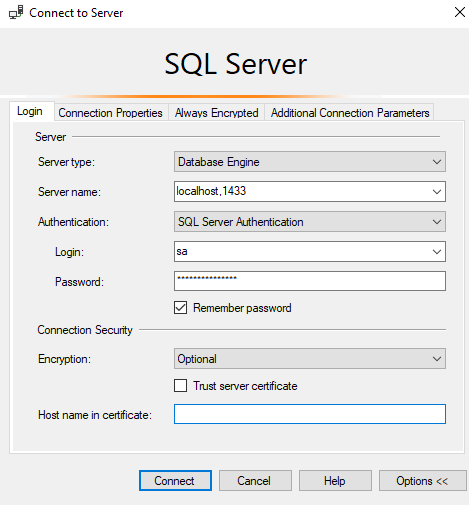

# Project Overview
This project serves as an introduction to the basics of containerization using Docker. It covers application and SQL Server containerization, aiming to demonstrate the basic concepts and operation of Docker. The application is written in ASP.NET Core, C#, Entity Framework, MVC.

## Requirements
- Docker
- .NET Core SDK
- Visual Studio (with Docker integration enabled)
- SQL Server Management Studio (optional, for database management)

## Step by step
* Create a new container:
docker run -e "ACCEPT_EULA=Y" -e "SA_PASSWORD=meinStarkesPasswort123!" -p 1433:1433 --name sqlserver -d mcr.microsoft.com/mssql/server:2022-latest

* Make sure you have other services that use port 1433 disabled, e.g. another SQL server. Otherwise, it will not be possible to access the database. 


* Make a test connection in SQL Server Managment Studio. 


* Create database:
```sql
CREATE DATABASE TestDB;
GO

USE TestDB;
GO

CREATE TABLE Person (
    ID int NOT NULL PRIMARY KEY,
    Name nvarchar(50) NULL
);
GO

INSERT INTO Person (ID, Name) VALUES 
(1, 'John Smith'),
(2, 'Emma Brown'),
(3, 'Michael Johnson');
GO
```

* Entity Framework scaffolding:
```bash
Scaffold-DbContext "Server=localhost,1433;Database=TestDB;User Id=sa;Password=meinStarkesPasswort123!;Encrypt=false;" Microsoft.EntityFrameworkCore.SqlServer -OutputDir Data -f
```

* Run with Docker Container .NET SDK
As a result, the Person table should be displayed:


## Running the Application

Visual Studio automates the process of running the Dockerized application. Simply open the solution in Visual Studio, and it will manage the Docker containers for the application automatically.

All the processes are not yet fully automated. There may be problems with connection strings, e.g. scaffolding may work from localhost. In the application, the connection string appears in TestDbContext.cs and appsettings.json. There, in turn, the ip of the container works, which can be downloaded like this:

```bash
docker inspect -f '{{range .NetworkSettings.Networks}}{{.IPAddress}}{{end}}' sqlserver
```
