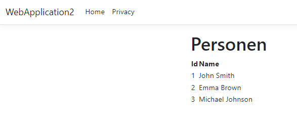

# Project Overview
This project serves as an introduction to the basics of containerization using Docker. It covers application and SQL Server containerization, aiming to demonstrate the basic concepts and operation of Docker. The application is written in ASP.NET Core, C#, Entity Framework, MVC.

## Requirements
- Docker
- .NET Core SDK
- Visual Studio (with Docker integration enabled)
- SQL Server Management Studio (optional, for database management)

## Step by step
* Create a new container:
docker run -e "ACCEPT_EULA=Y" -e "SA_PASSWORD=meinStarkesPasswort123!" -p 1433:1433 --name sqlserver -d mcr.microsoft.com/mssql/server:2022-latest

* Make sure you have other services that use port 1433 disabled, e.g. another SQL server. Otherwise, it will not be possible to access the database: 


* Make a test connection in SQL Server Managment Studio: 


* Create database:
```sql
CREATE DATABASE TestDB;
GO

USE TestDB;
GO

CREATE TABLE Person (
    ID int NOT NULL PRIMARY KEY,
    Name nvarchar(50) NULL
);
GO

INSERT INTO Person (ID, Name) VALUES 
(1, 'John Smith'),
(2, 'Emma Brown'),
(3, 'Michael Johnson');
GO
```

* Entity Framework scaffolding in Visual Studio -> Package Manager Console:
```bash
Scaffold-DbContext "Server=localhost,1433;Database=TestDB;User Id=sa;Password=meinStarkesPasswort123!;Encrypt=false;" Microsoft.EntityFrameworkCore.SqlServer -OutputDir Data -f
```

* Running the Application:

Run with Docker Container .NET SDK. Visual Studio automates the process of running the Dockerized application. Simply open the solution in Visual Studio, and it will manage the Docker containers for the application automatically.

As a result, the Person table should be displayed:



* TO DO
There are problems with connection strings. Entity Framework scaffolding works with localhost:
```bash
Scaffold-DbContext "Server=**localhost**,1433;Database=TestDB;User Id=sa;Password=meinStarkesPasswort123!;Encrypt=false;" Microsoft.EntityFrameworkCore.SqlServer -OutputDir Data -f
```

Scaffolding generates the TestDBContext.cs file, where the connection string appears:
```c#
optionsBuilder.UseSqlServer(“Server=localhost,1433;Database=TestDB;User Id=sa;Password=meinStarkesPasswort123!;Encrypt=false;”);
```
In order for the application to work properly, in this connection string you need to replace the "localhost" with the ip of the container, and you can get it this way:
``bash
docker inspect -f '{{range .NetworkSettings.Networks}}{{.IPAddress}}{{end}}' sqlserver
```
Output could be 172.17.0.2, for example, so the connection string in TestDBContext.cs should look like this:
```c#
optionsBuilder.UseSqlServer(“Server=**172.17.0.2**,1433;Database=TestDB;User Id=sa;Password=meinStarkesPasswort123!;Encrypt=false;”);
```
Taki sam ciąg połączenia powinien być w appsettings.json”
```json
„ConnectionStrings": {
  „DefaultConnection": „Server=172.17.0.2,1433;Database=TestDB;User Id=sa;Password=meinStarkesPasswort123!;Encrypt=false;”
},
```
Everything would be simpler if scaffolding could be done using ip container. The question is how to do it? 


